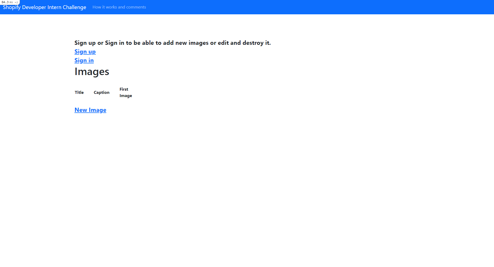
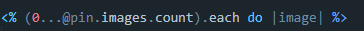
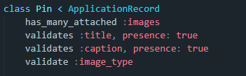
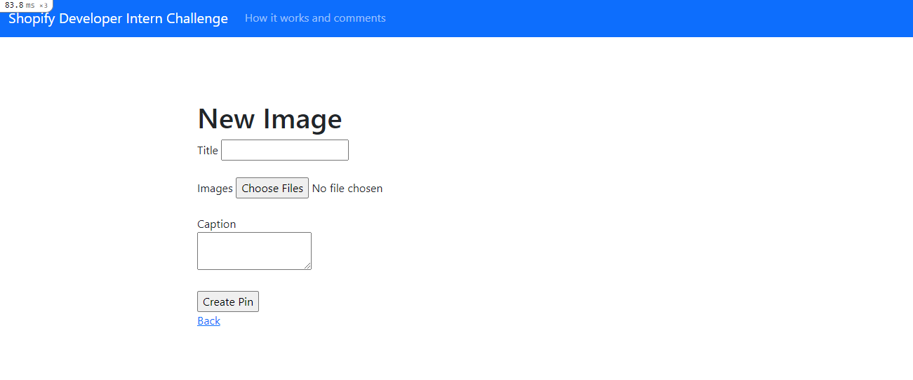
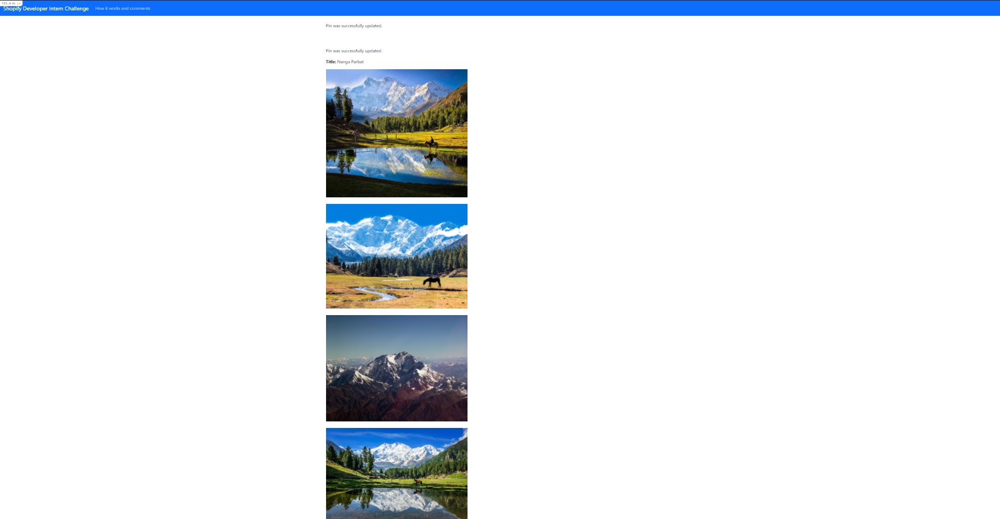
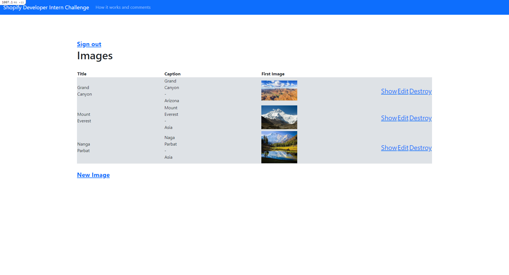

# README

Versions used to develop and test the application:<br>
Ruby version: 3.0.1p64<br>
Sqlite3 version: 3.35.5<br>
Rails version: 6.1.3.1<br>
Yarn version: 1.22.10<br>

* How to use it

To be able to use this application, just download the whole project and use any terminal to go to project's root folder(ImageRepository). Run:<br>
``` bundle install ```<br>
In the terminal to install everything that I used and after that type:<br>
```rails webpacker:install```<br>
```rails db:migrate RAILS_ENV=development```<br>
To finish with, just type:<br>
```rail s```<br> 
to initiate the server.<br><br>
and goes to your browser of preference and type localhost:3000, if everything is working fine you should see this screen:<br><br>
<br><br>
I did this option (ADD image(s) to the repository) and I will go through each section and explain how I implemented it.<br>

* one / bulk / enormous amount of images<br> 

To do this, firstly I created an active storage using ruby on rails, after that I just changed the class "Pin" to<br>     
has_many_attached in the image field, the has_many can receive any number of images, while has_one accept just one.<br>
In the home page I am just displaying the first image of the uploaded images, doesn't matter if the user uploaded one, 5 or 500 images.<br>
In the show.html.erb I created a loop to show each image starting from 0 until the final number of images <br><br>
<br><br>

* private or public (permissions) 

This one is not perfect, I really tried my best and the result that I got is, only logged users can have access of editing, destroying and creating<br>
new images, I used the gem devise to develop this:<br>
Login system - Sign Up, Sign in and Sign out <br>
Permission denied for who is not user of the repository<br>

I saw an option of creating an admin role to the user, so only the admin can have access to his own images, but I don't like this implementation cause the private should be
available to everyone.<br>

* secure uploading and stored images <br>

The images are completely safe stored in the amazon s3 service, to be safe uploading in the repository, I added validates statements in the pin.rb <br>
so the user can't upload pins if not every section is completed.<br><br>
<br><br>
(```amazon:
service: S3
access_key_id: <%= Rails.application.credentials.dig(:aws, :access_key_id) %>
secret_access_key: <%= Rails.application.credentials.dig(:aws, :secret_access_key) %>
region: us-east-2
bucket: imagerepository-jovic```)
  
* Here are some screenshots of the application: <br><br>
* Sign In Page<br><br>
<br><br>
* New Image Page <br><br>
<br><br>
* Uploading multiple images <br><br>
<br><br>
* Home screen when signed in <br><br>
<br><br>
# Fall-2021---Shopify-Developer-Intern-Challenge
